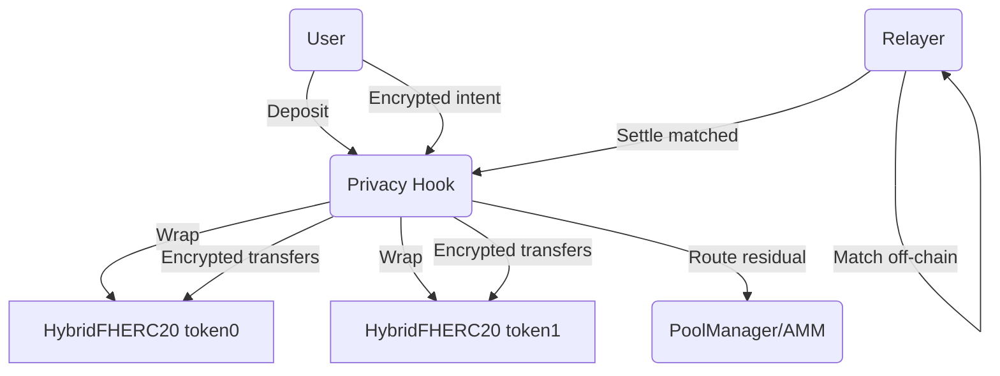
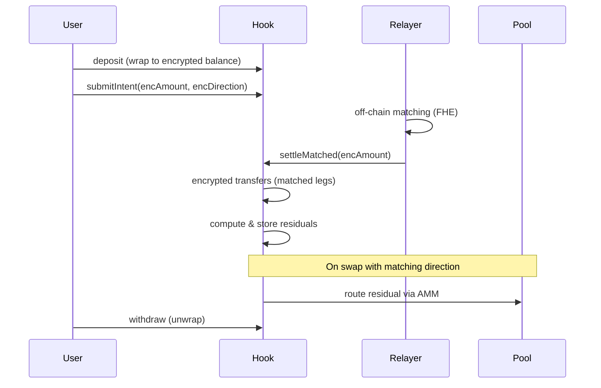

# Privacy Hook

[](LICENSE)
[](https://book.getfoundry.sh/)
[](https://hardhat.org/)
[](https://docs.uniswap.org/contracts/v4/overview)
[](https://docs.fhenix.zone/)
[](https://github.com/FhenixProtocol/cofhe-scaffold-eth)

## Description
Privacy Hook is a privacy-first Uniswap v4 hook that keeps trade intents (amount + direction) fully encrypted with Fhenix FHE. Users wrap ERC20s into encrypted balances, submit encrypted intents, and a relayer privately matches them off-chain. Matched legs settle internally with zero AMM slippage/fees; any unmatched residual is automatically routed through the AMM via hook callbacks.

## Problem Statement
Public mempools leak trade direction/size, inviting MEV (frontrun/sandwich) and harming large intent-based orders. Intent matching alone does not hide amounts or direction.

## Solution & Impact (incl. financial)
- **End-to-end encryption:** Balances, amounts, and directions are FHE-encrypted—hidden from everyone, including the hook.
- **Private matching:** Relayer with granted FHE permissions matches off-chain; only encrypted settlement deltas touch chain.
- **Residual routing:** Unmatched portions auto-route through the AMM, preserving capital efficiency while staying private.
- **Financial impact:** Reduces MEV slippage and sandwich losses; internal netting removes LP fees on matched flow; residual routing minimizes leftover risk and improves execution quality for intent traders and aggregators.

## Architecture & Components
- **PrivacyHook (Uniswap v4 hook):** Intent registry, encrypted settlement, residual computation, and routing. Permissions enabled: `beforeSwap`, `afterSwap`, `beforeAddLiquidity`, `afterRemoveLiquidity`.
- **HybridFHERC20 tokens:** Encrypted balance ledger (wrap/unwrap between public ERC20 and encrypted supply).
- **Relayer/Matcher:** Off-chain FHE-permitted actor that batches and submits `settleMatched`.
- **PoolManager / AMM:** Receives residual flow when swap direction matches stored residuals.
- **Frontend (Next.js + Scaffold-ETH):** Simple UI for deposits, intents, and viewing state.
- **Fhenix runtime:** Required for FHE precompiles (localfhenix or Fhenix testnet). Standard EVM chains (e.g., Sepolia) cannot execute FHE operations.

## Flows & Diagrams
### User + Judge View (high level)




## Architecture Brief (what exists)
- Encrypted intents/balances (FHE), residual tracking, and hook callbacks are implemented.
- Residual routing emits observability events; full routing through PoolManager is wired via `beforeSwap` path.
- Frontend scaffold can be pointed to deployed addresses/RPC for demos.
- Dual deploy strategy: Fhenix for real FHE; Sepolia only for interface testing (FHE calls revert).

## Installation & Setup
```bash
# install deps
pnpm install

# build contracts
forge build

# run hardhat compile (if needed for TS typings)
pnpm hardhat compile
```

## Testing
```bash
# all tests (134 passing)
forge test

# specific suite
forge test --match-path test/PrivacyHookWithdraw.t.sol

# coverage
forge coverage
```

## Scripts
- Deploy Fhenix/localfhenix: `npx hardhat run scripts/deploy-privacy.ts --network fhenix`
- Deploy Sepolia (no FHE execution): `npx hardhat run scripts/deploy-sepolia.ts --network sepolia`
- Cast examples: see `docs/CAST_INTERACTIONS.md` and `scripts/cast-*.sh`

## Demo Example
- Recommended: run on Fhenix (localfhenix) so FHE precompiles are available.
- Sepolia demo is interface-only; FHE ops will revert. Use `scripts/cast-interactions.sh` with deployed addresses to show call patterns.
- (If you have txids, add them here to show an end-to-end settle or deposit/withdraw.)

## Roadmap
- Integrate full residual routing swap path (unwrap + PoolManager.swap) once PoolManager plumbing is finalized.
- Add more frontend flows (intent submission, residual view, relayer simulation).
- Harden invariants with live PoolManager integration.
- Add automated Fhenix localnet spin-up in CI.

## Documentation
- Deployment: `docs/DEPLOY.md`
- Cast examples: `docs/CAST_INTERACTIONS.md`
- Sepolia notes: `docs/SEPOLIA_DEPLOYMENT.md`
- Verification (manual): `docs/VERIFICATION.md`, `docs/VERIFICATION_SUMMARY.md`
- Flattened source: `docs/PrivacyHook.flattened.sol`

## Status & Limits
- Tested: 134 passing tests (unit, integration, residuals, settlement, invariants, callbacks).
- Networks: FHE features require Fhenix. On Sepolia, FHE precompile calls will fail by design.
- Hook permissions active: `beforeSwap`, `afterSwap`, `beforeAddLiquidity`, `afterRemoveLiquidity`.
