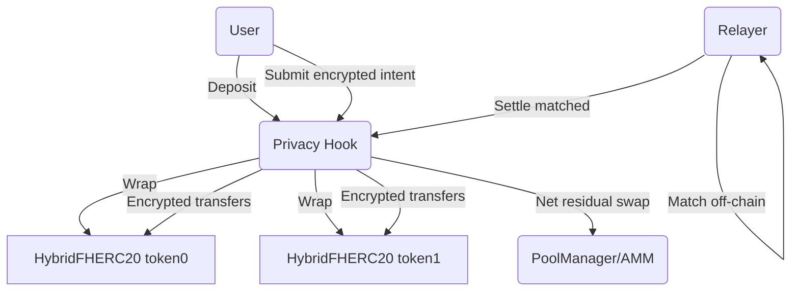
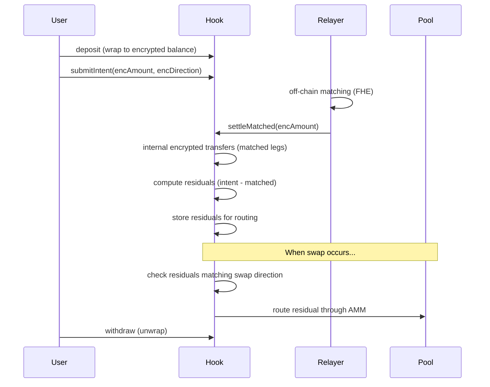

# Privacy Hook

[](LICENSE)
[](https://book.getfoundry.sh/)
[](https://docs.uniswap.org/contracts/v4/overview)
[](https://docs.fhenix.zone/)
[](https://github.com/FhenixProtocol/cofhe-scaffold-eth)

## Description
Privacy Hook is a privacy-first Uniswap v4 hook that enables fully encrypted swaps using Fhenix's Fully Homomorphic Encryption (FHE). Users deposit tokens to receive encrypted balance tokens (ERC7984), submit encrypted trade intents (amount + direction), and a relayer privately matches them off-chain. Matched trades settle internally with zero fees/slippage; unmatched residual portions are automatically routed through the AMM via hook callbacks.

## Problem
Public mempool transparency leaks trade direction and size, enabling MEV (frontrunning/sandwiching) and harming large orders even when only intent is visible.

## Solution
End-to-end encryption with Fhenix FHE:
- Amounts, directions, and balances stay encrypted—even to the contract.
- Off-chain relayer (with FHE permissions) matches intents privately; only settlement deltas touch chain.
- Netting reduces AMM exposure; matched legs execute as internal encrypted transfers.

## Architecture (high level)
- **Users**: Deposit ERC20 → receive encrypted balances; submit encrypted intents (amount + direction).
- **Relayer/Matcher**: Off-chain, FHE-permitted; batches compatible intents and submits encrypted settlement.
- **Privacy Hook (Uniswap v4)**: Handles intent registry, encrypted accounting, and residual routing. Hook callbacks (`beforeSwap`, `afterSwap`, `beforeAddLiquidity`, `afterRemoveLiquidity`) are **enabled** and route unmatched intent portions through the AMM when swap directions match.
- **HybridFHERC20 tokens**: Encrypted balance ledger; wrap/unwrap between public ERC20 and encrypted supply.
- **Residual Routing**: After settlement, unmatched portions of intents are computed and stored. When swaps occur, residuals matching the swap direction are automatically routed through the AMM.
- **Optional yield path**: Idle liquidity can be sent to an external lender and returned JIT for swaps.

### Flow (textual)
1) **Deposit**: User wraps ERC20 → encrypted balance (HybridFHERC20).  
2) **Intent**: User submits encrypted amount + direction to the hook.  
3) **Match**: Relayer privately matches opposing intents off-chain.  
4) **Settle**: Relayer calls `settleMatched`; matched legs move as encrypted transfers. Unmatched portions are computed as residuals (intent.amount - matchedAmount) and stored.  
5) **Residual Routing**: When swaps occur, `beforeSwap` hook checks for residuals matching the swap direction and routes them through the AMM automatically.  
6) **Withdraw**: User unwraps encrypted balance back to ERC20 when desired.  

### Diagrams (mermaid)




## Key Innovation (Triple Privacy)
- **Encrypted balances (ERC7984)**: balances stored as `euint128` via FHE, invisible to everyone.
- **Encrypted intents**: amounts + directions (`euint128 + ebool`) stay hidden.
- **Off-chain matching**: relayer with FHE permissions matches privately; only settlement touches chain.
- **Residual routing**: Unmatched intent portions automatically route through AMM while maintaining encryption.

## Result
MEV bots cannot see what you trade, how much, or which direction—frontrunning becomes impractical with on-chain FHE-protected intents and balances. Matched trades execute with zero fees/slippage, while unmatched residuals automatically route through the AMM, maximizing capital efficiency while maintaining privacy.

## Current Implementation Status
- **Hook permissions**: `beforeSwap`, `afterSwap`, `beforeAddLiquidity`, and `afterRemoveLiquidity` are **enabled** and fully functional.
- **Residual routing**: ✅ **Implemented** - Unmatched intent portions are computed after settlement and automatically routed through the AMM when swap directions match. Residual tracking uses encrypted FHE operations to maintain privacy.
- **Network support**: Requires Fhenix (localfhenix or Fhenix testnet) for FHE precompiles. Deployments to standard EVM testnets (e.g., Sepolia) cannot execute encrypted intents/settlements.
- **Frontend**: CoFHE scaffold wired for deposits/intents/settlement; must point to a Fhenix-capable RPC and deployed contracts to function end-to-end.
- **Tests**: 42 tests (unit, fuzz, invariant) cover encrypted balances, intent flows, and residual routing under CoFHE mocks. Real encrypted flow on-chain requires Fhenix.

## Quick Start

### Prerequisites
- [Foundry](https://book.getfoundry.sh/getting-started/installation)
- [Node.js](https://nodejs.org/) and [pnpm](https://pnpm.io/)
- Fhenix network access (localfhenix or Fhenix testnet)

### Testing
```bash
# Run all tests
forge test

# Run with coverage
forge coverage

# Run specific test suite
forge test --match-contract PrivacyHook
```

### Deployment
See [DEPLOY.md](./DEPLOY.md) for detailed deployment instructions.

For Fhenix testnet:
```bash
# Set environment variables in .env
FHENIX_RPC_URL=https://api.nitrogen.fhenix.zone
FHENIX_CHAIN_ID=42069
FHENIX_PRIVATE_KEY=your_private_key
FHENIX_RELAYER=relayer_address
FHENIX_POOL_MANAGER=pool_manager_address

# Deploy
npx hardhat run scripts/deploy-privacy.ts --network fhenix
```

## Test Coverage
- **Unit Tests**: 19 tests for `HybridFHERC20`, 9 tests for `PrivacyHook`
- **Fuzz Tests**: 3 fuzz tests covering edge cases in token operations
- **Invariant Tests**: 1 invariant test ensuring supply consistency
- **Integration Tests**: 7 tests for Uniswap v4 integration utilities
- **Total**: 42 tests, all passing ✅
