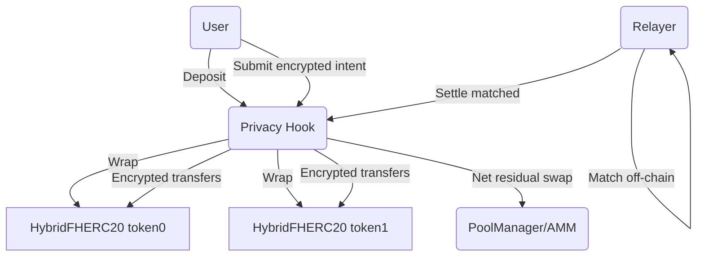
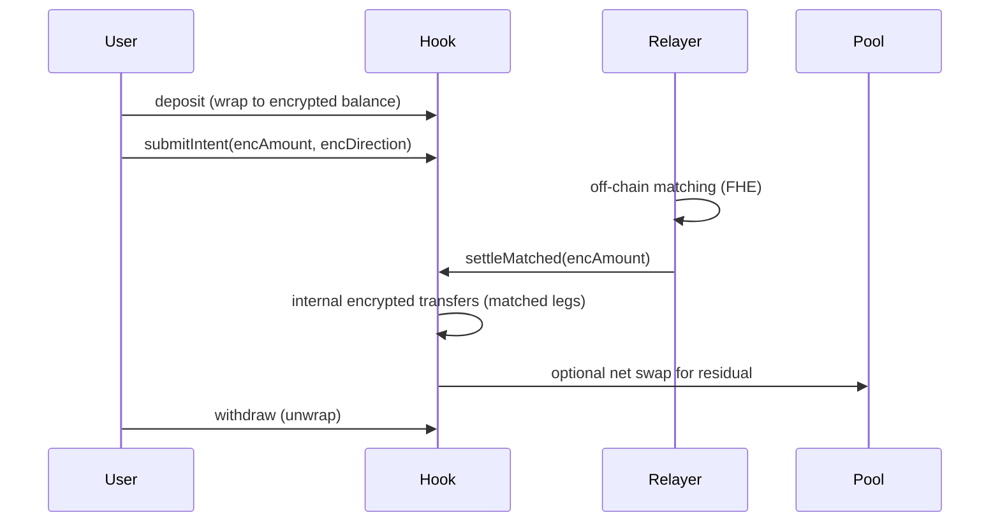

# Privacy Hook

## Description
Privacy Hook is a privacy-first Uniswap v4 hook that enables fully encrypted swaps using Fhenix’s Fully Homomorphic Encryption (FHE). Users deposit tokens to receive encrypted balance tokens (ERC7984), submit encrypted trade intents (amount + direction), and a relayer privately matches them off-chain. Matched trades settle internally with zero fees/slippage; only the net residual volume would touch the AMM when swap callbacks are enabled.

## Problem
Public mempool transparency leaks trade direction and size, enabling MEV (frontrunning/sandwiching) and harming large orders even when only intent is visible.

## Solution
End-to-end encryption with Fhenix FHE:
- Amounts, directions, and balances stay encrypted—even to the contract.
- Off-chain relayer (with FHE permissions) matches intents privately; only settlement deltas touch chain.
- Netting reduces AMM exposure; matched legs execute as internal encrypted transfers.

## Architecture (high level)
- **Users**: Deposit ERC20 → receive encrypted balances; submit encrypted intents (amount + direction).
- **Relayer/Matcher**: Off-chain, FHE-permitted; batches compatible intents and submits encrypted settlement.
- **Privacy Hook (Uniswap v4)**: Handles intent registry and encrypted accounting. Hook callbacks (`beforeSwap`, `afterSwap`, `beforeAddLiquidity`, `afterRemoveLiquidity`) are **enabled** and observe AMM operations but currently pass-through (no residual routing logic yet).
- **HybridFHERC20 tokens**: Encrypted balance ledger; wrap/unwrap between public ERC20 and encrypted supply.
- **Optional yield path**: Idle liquidity can be sent to an external lender and returned JIT for swaps.

### Flow (textual)
1) **Deposit**: User wraps ERC20 → encrypted balance (HybridFHERC20).  
2) **Intent**: User submits encrypted amount + direction to the hook.  
3) **Match**: Relayer privately matches opposing intents off-chain.  
4) **Settle**: Relayer calls `settleMatched`; matched legs move as encrypted transfers. Residual routing to AMM is observed via hook callbacks but not yet implemented.  
5) **Withdraw**: User unwraps encrypted balance back to ERC20 when desired.  

### Diagrams (mermaid)

## Key Innovation (Triple Privacy)
- **Encrypted balances (ERC7984)**: balances stored as `euint64` via FHE, invisible to everyone.
- **Encrypted intents**: amounts + directions (`euint64 + euint8`) stay hidden.
- **Off-chain matching**: relayer with FHE permissions matches privately; only settlement touches chain.

## Result
MEV bots cannot see what you trade, how much, or which direction—frontrunning becomes impractical with on-chain FHE-protected intents and balances, once run on a Fhenix-capable network and, if desired, with swap callbacks enabled.

## Current Implementation Status
- **Hook permissions**: `beforeSwap`, `afterSwap`, `beforeAddLiquidity`, and `afterRemoveLiquidity` are **enabled**. Callbacks currently pass-through (observe but don't modify AMM behavior). Residual routing logic for unmatched intents is not yet implemented.
- **Network support**: Requires Fhenix (localfhenix or Fhenix testnet) for FHE precompiles. Deployments to standard EVM testnets (e.g., Sepolia) cannot execute encrypted intents/settlements.
- **Frontend**: CoFHE scaffold wired for deposits/intents/settlement; must point to a Fhenix-capable RPC and deployed contracts to function end-to-end.
- **Tests**: 42 tests (unit, fuzz, invariant) cover encrypted balances and intent flows under CoFHE mocks. Real encrypted flow on-chain requires Fhenix.
